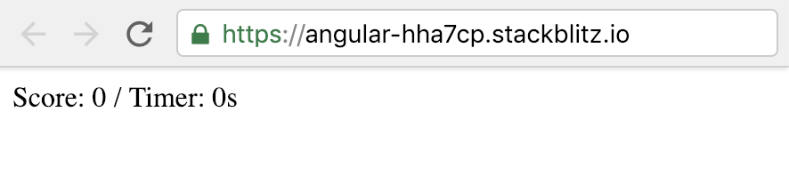
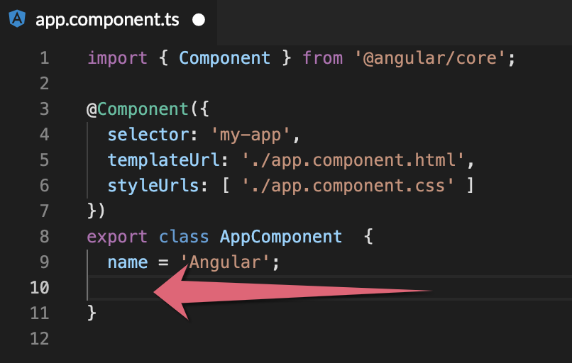
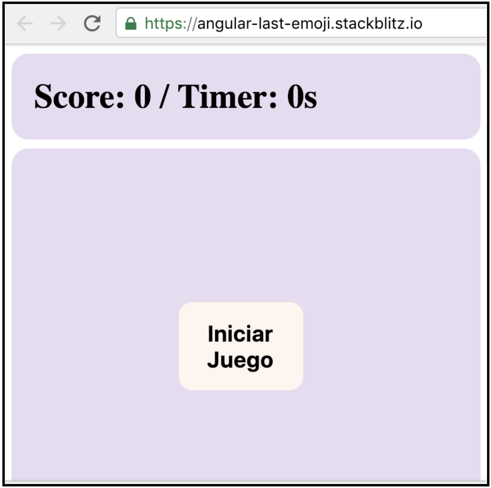

# 4. ¿Cuál fue el emoji? 👑

## 💡 Introducción 💡  <a id="1-introduccion"></a>

Construiremos un juego de memoria.   
Tendremos:   
Un botón que inicie el juego, un contandor de segundos que nos dira cuanto tiempo hemos llevamos jugando, e inmediatamente se nos presentara un emoji que vamos a memorizar, paso siguiente, aparecerá una serie de emojis en pantalla, y tú tendrás que responder si es el emoji que tenias que recordar o no, ademas, celebraremos cuando identifiques exitosamente el emoji, ¡¡con una linda imagen de un gatito 😻😻!!.

¿Estás lista?

¡**Claro que si! ¡Ya tienes experiencia! 💪**

[**¡Aquí puedes encontrar el demo!**](https://angular-last-emoji.stackblitz.io/)**​**

## Paso 1: Crear vista del tablero de juego **🎮**  <a id="paso-1-crear-el-titulo"></a>

Vamos a crear el entorno donde vamos a jugar. Para ello iremos al archivo **app.component.html** y borramos todo el contenido y vamos a colocar lo siguiente:



```markup
<div class="scoreScreen">
	<label>
    Score:
  </label>
  <label>
    {{scoreGame || 0}}
  </label>
	<label>
    / Timer:
  </label>
  <label>
    {{0}}s
  </label>
</div>
<div class="fatherScreen">
 <div class="childScreen" *ngIf='showBtnStart'>
   <button (click)="startGame()">Iniciar Juego</button>
 </div>
</div>
```



**Deberías ver algo así: 👇**




**Por si tienes alguna duda. Aquí te explicamos cómo funciona: 👷‍♀️**

**1.** La etiqueta **Div** nos ayuda a definir un orden.  
  
**2.** La etiqueta **label**  es usualmente usada para contener texto.  
  
**3.** El elemento **{{}}**  es una forma de comunicar nuestro [componente](https://platzi.com/tutoriales/1153-angular/1619-que-son-los-componentes-en-angular/), de esta manera el **app.component.ts**, se comunica con **app.component.html,** y ****el **\|\|** dentro ****del ****elemento es una condición "o" que nos va a mostrar el número cero mientras no exista datos en las variables.  
  
**4.** El elemento [**class**](https://css-tricks.com/almanac/selectors/c/class/)**=""**, nos va a ayudar a definir los estilos de nuestra aplicación \(no solo tiene esa utilidad, pero la usaremos para eso en el ejercicio de hoy\).  
  
 **5.** El elemento **\***[**ngIf**](https://angular.io/api/common/NgIf)**=**, nos va a ayudar a ocultar o mostrar elementos, depende de la variable que tengamos asignada dentro del **\*ngIf=**, en este caso tenemos la variable **showBtnStart** donde la asignaremos en el **app.component.ts** mas adelante.   
  
**6.** El elemento **button** nos va a crear un botón que será el que usaremos para iniciar nuestro juego.  
  
**7.** El elemento **\(click\)=""** controla el evento clic, cuando el usuario de clic a el botón, se va a llamar la función **startGame\(\)** donde la asignaremos en el **app.component.ts** mas adelante.


## Paso 2: Adicionar lógica a tablero de juego 🔭 <a id="paso-1-crear-el-titulo"></a>

Ahora vamos a modificar el archivo **app.component.ts**, ****en ****este ****archivo vamos a adicionar la declaración de variables que vimos en el archivo  **app.component.html**, y además vamos a agregar unas funciones.  
En este archivo, vamos a encontrar el siguiente código:





```typescript
  scoreGame = '';
  showBtnStart = true;

// También vamos a incluir funciones
  startGame() {
    this.randomEmoji();
  }
  randomEmoji() {
  }

```




**Por si tienes alguna duda. Aquí te explicamos cómo funciona: 👷‍♀️**

**1.** A la variable **scoreGame** se asigna vacío, de esta manera le estamos diciendo que es [tipo](https://www.uno-de-piera.com/tipos-en-typescript/) **String**.  
  
**2.** A la variable **showBtnStart** se asigna **true**, de esta manera le estamos diciendo que es [tipo](https://www.uno-de-piera.com/tipos-en-typescript/) **Boolean.**  
Además, cuando le asignamos **true**, en nuestro \***ngIf** de **app.component.html** deberá mostrar todas las lineas de código que contenga este.

**3.** Creamos una función llamada **startGame\(\)**, en esta función adicionaremos la lógica que se deberá ejecutar, cuando el usuario le da clic al botón "Iniciar Juego".

**4.** La función **startGame\(\)** llamara ****a ****su ****vez **randomEmoji\(\),** que ****analizaremos ****en ****el ****paso ****4, por eso, la creamos, pero la dejamos sin lógica.


## Paso **3**: Agregar estilos al tablero de juego 🎨🖌

¡Vamos a hacer que nuestro tablero tenga color! agregando un poco de CSS, ¿recuerdas las clases que usamos en nuestro **app.component.html**,?, ¡llego el tiempo de usarlas!. Reemplaza el contenido de **app.component.css** con este:



```css
button {  /* Afecta todas las etiquetas HTML button */
  background-color: seashell; /* Determina el color de fondo de nuestro botón */
  border: none; /* Nos elimina el borde a nuestro botón */
  border-radius: 12px; /* Hace los extremos de nuestro botón redondeados */
  padding: 16px;  /* Crea un espacio entre el borde de nuestro botón y el centro del botón */
  font-size: 20px; /* Determina el tamaño de letra dentro de nuestro bóton */
  font-weight: bold; /* Hace que nuestro texto se vea en Negrita */
  margin-right: 10px /* Crea un espacio entre el borde de nuestro botón y el exterior del mismo */
}

button:hover { /* Afecta todas las etiquetas HTML button en el momento que el cursor este sobre el */
  background: salmon; /* Determina el color de fondo de nuestro botón */
  border-style: solid; /* Nos crea un borde a nuestro botón de linea continuia */
  border-color: pink; /* Nos da un color a el borde de nuestro botón */
}

label { /* Afecta todas las etiquetas HTML label */
  white-space: nowrap; /* hace que nuestro texto no se quiebre, y se vea en una sola línea */
}
.childScreen { /* El . hace referencia a una clase, así que va a afectar todos los elementos HTML con esta clase */
  width: 120px; /* Determina el ancho de la sección */
}

.fatherScreen { /* El . hace referencia a una clase, así que va a afectar todos los elementos HTML con esta clase */
  height: 350px; /* Determina la altura de la sección */
  display: grid;  /* Define el elemento como un contenedor de cuadrícula */
  justify-content: center; /* Centra los elementos horizontalmente */
  align-items: center; /* Centra los elementos verticalmente */
  background: #e9dbf1; /* Determina el color de fondo de la sección */
  border-radius: 15px; /* Hace los extremos de nuestra sección redondeados */
}

.scoreScreen { /* El . hace referencia a una clase, así que va a afectar todos los elementos HTML con esta clase */
  background: #e9dbf1;  /* Determina el color de fondo de la sección */
  border-radius: 15px; /* Hace los extremos de la sección redondeados */
  box-sizing: content-box; /* controla cómo se maneja el elemento al que se aplica.
Los valores de ancho y alto se aplican al contenido, el relleno y el borde. */
  padding: 20px; /* Crea un espacio entre el borde de la sección y el centro la sección */
  margin-bottom: 8px; /* Crea un espacio entre el borde de la sección y el exterior de la misma */
  font-weight: bold; /* Hace que nuestro texto se vea en Negrita */
  font-size: 30px; /* Determina el tamaño de letra dentro de la sección */
}
```



¿Luce como mucho verdad?  
Pero en cada una de las líneas puedes encontrar la explicación sobre ¿qué es? o ¿qué hace?. Si quieres profundizar tus conocimientos en CSS, aquí te dejo un**a** Wiki con gran cantidad de definiciones y artículos. 🤓[https://css-tricks.com/](https://css-tricks.com/).

**Deberías ver algo así: 👇**



  


