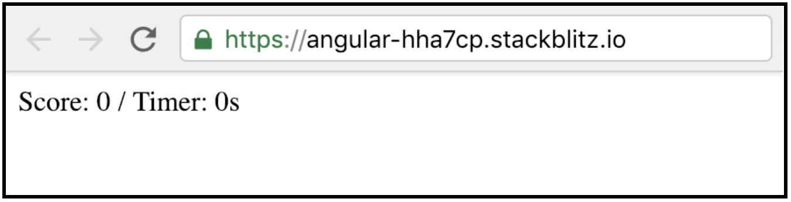

# 4. ¿Cuál fue el emoji? 👑

## 💡 Introducción 💡 <a id="1-introduccion"></a>

Construiremos un juego de memoria.   
Tendremos un botón que inicie el juego, e inmediatamente se nos presentara un emoji que vamos a memorizar, paso siguiente, aparecerá una serie de emojis en pantalla, y tú tendrás que responder si es el emoji que tenias que recordar o no.

¿Estás lista?  
  
¡**Claro que si! ¡Ya tienes experiencia! 💪**

 [**¡Aquí puedes encontrar el demo!**](https://angular-last-emoji.stackblitz.io/)**​**

## Paso 1: Crear vista del tablero de juego **🎮** <a id="paso-1-crear-el-titulo"></a>

Vamos a crear el entorno donde vamos a jugar. Para ello iremos al archivo **app.component.html** y borramos todo el contenido y vamos a colocar lo siguiente:  




```markup
<div class="scoreScreen">
	<label>
    Score:
  </label>
  <label>
    {{scoreGame || 0}}
  </label>
	<label>
    / Timer:
  </label>
  <label>
    {{timerGame || 0}}s
  </label>
</div>
<div class="fatherScreen">
 <div class="childScreen" *ngIf='showBtnStart'>
   <button (click)="startGame()">Iniciar Juego</button>
 </div>
</div>
```



👉 La etiqueta **Div** nos ayuda a definir un orden.  
👉 La etiqueta **label**  es usualmente usada para contener texto.  
👉 El elemento **{{}}**  es una forma de comunicar nuestro [componente](https://platzi.com/tutoriales/1153-angular/1619-que-son-los-componentes-en-angular/), de esta manera, el **app.component.ts**, se comunica con **app.component.html,** y ****el **\|\|** dentro ****del ****elemento es una condición "o" que nos va a mostrar el 0 mientras no exista datos en las variables.  
👉 El elemento [**class=""**](https://css-tricks.com/almanac/selectors/c/class/), nos va a ayudar a definir los estilos de nuestra aplicación \(no solo tiene esa utilidad, pero la usaremos para eso en el ejercicio de hoy\).  
 👉 El elemento [**\*ngIf+**](https://angular.io/api/common/NgIf), nos va a ayudar a ocultar o mostrar elementos, depende de la variable que tengamos asignada dentro del **\*ngIf=**, en este caso tenemos la variable **showBtnStart** donde la asignaremos en el **app.component.ts** mas adelante.   
👉 El elemento **button** nos va a crear un botón que será el que usaremos para iniciar nuestro juego.  
👉 El elemento **\(click\)=""** es un evento, este evento está asociado al clic, cuando el usuario le de clic a el botón, se va a llamar la función **startGame\(\)** donde la asignaremos en el **app.component.ts** mas adelante.

**Deberías ver algo así: 👇**  




Vamos a crear el entorno donde vamos a jugar. Para ello iremos al archivo **app.component.html** y borramos todo el contenido y vamos a colocar lo siguiente:  




```text
<div class="scoreScreen">
	<label>
    Score:
  </label>
  <label>
    {{scoreGame || 0}}
  </label>
	<label>
    / Timer:
  </label>
  <label>
    {{timerGame || 0}}s
  </label>
</div>
<div class="fatherScreen">
 <div class="childScreen" *ngIf='showBtnStart'>
   <button (click)="startGame()">Iniciar Juego</button>
 </div>
</div>
```



